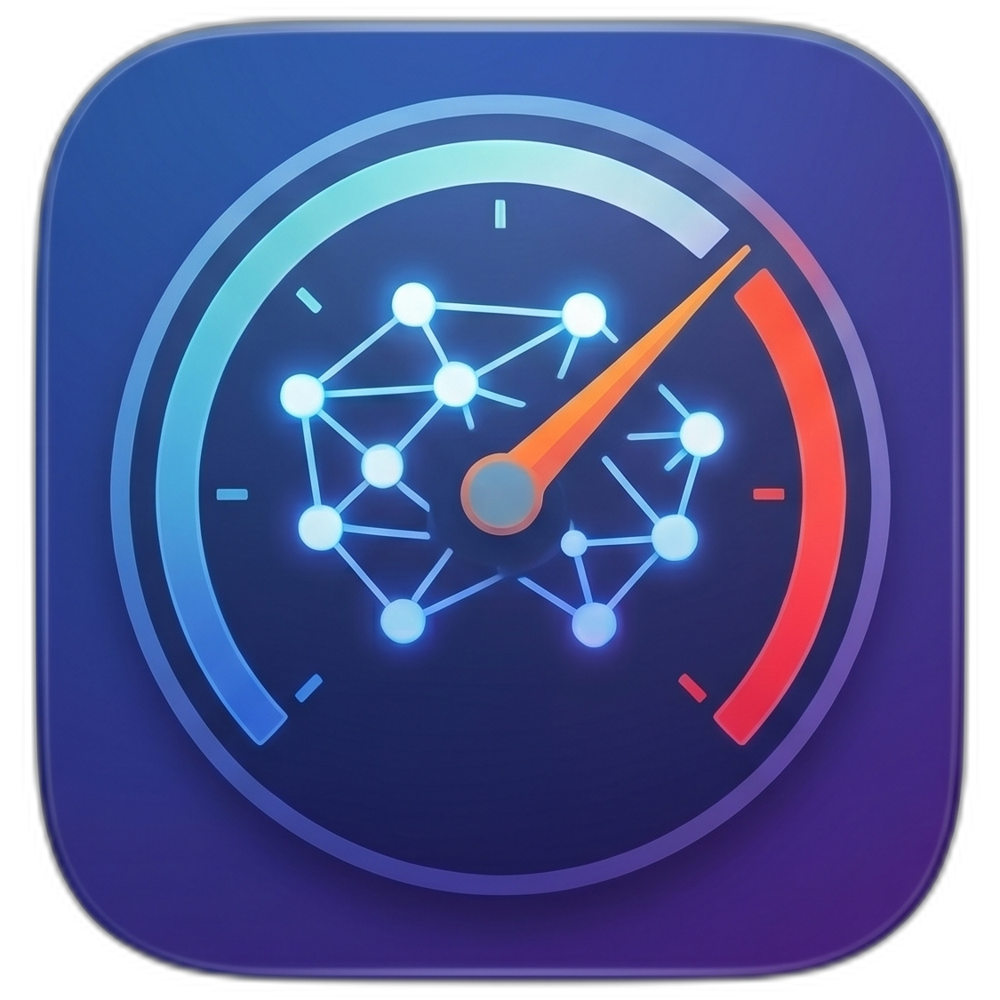
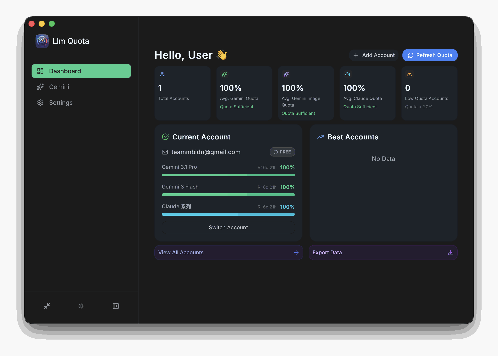
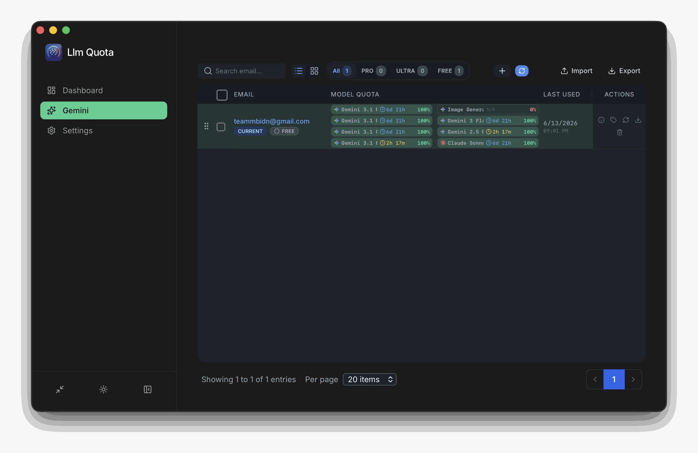

<div align="center">
  
  <h1>Llm Quota</h1>
  <p>A compact, high-density dashboard to manage quota limits for LLM accounts.</p>

  <a href="https://github.com/theasmat/llm-quota/releases/latest">
    
  </a>
  <a href="https://github.com/theasmat/llm-quota/releases/latest">
    
  </a>
  <a href="https://github.com/theasmat/llm-quota/releases/latest">
    
  </a>
  <br/>
  
  <p>
    <a href="https://github.com/theasmat/llm-quota/stargazers">
      
    </a>
    <a href="https://github.com/theasmat/llm-quota/network/members">
      
    </a>
    <a href="https://github.com/theasmat/llm-quota/issues">
      
    </a>
    <a href="https://github.com/theasmat/llm-quota/blob/master/LICENSE">
      
    </a>
  </p>
</div>

<br/>

Llm Quota is a compact, high-density dashboard built with Tauri and React to manage and monitor quota limits for LLM accounts like Google Gemini. Designed to look and feel like a professional spreadsheet-style internal tool, it offers a fast, local-first experience with a dense data grid, dark/light theme support, and a highly responsive native UI.

<br/>

## 📖 Table of Contents

- [💻 Installation](#-installation)
- [🚀 Downloads](#-downloads)
- [✨ Features](#-features)
- [🛠️ Tech Stack](#️-tech-stack)
- [⚙️ Setup & Development](#️-setup--development)
- [📷 Screenshots](#-screenshots)
- [🤝 Contributing](#-contributing)
- [📄 License](#-license)

<br/>

## 💻 Installation

### Automated Install Scripts

The easiest way to install on macOS and Linux is by using the automated scripts:

**macOS:**
```bash
curl -fsSL https://raw.githubusercontent.com/theasmat/llm-quota/master/install/mac.sh | bash
```

**Linux:**
```bash
curl -fsSL https://raw.githubusercontent.com/theasmat/llm-quota/master/install/linux.sh | bash
```

### macOS (Homebrew)

```bash
brew install --no-quarantine theasmat/llm-quota/llm-quota

```

> **Note for macOS Users:** If you install the app manually and encounter "App is damaged" or "Unidentified developer" errors, please check the [macOS Troubleshooting Guide](macOS_troubleshooting.md) for quick solutions.

## 🚀 Downloads

Select the appropriate package for the target operating system.

| 🍎 macOS                                                                      | 🪟 Windows                                                       | 🐧 Linux                                                                  |
| ----------------------------------------------------------------------------- | ---------------------------------------------------------------- | ------------------------------------------------------------------------- |
| [⬇️ Universal (.dmg)](https://github.com/theasmat/llm-quota/releases/download/v0.1.1/Llm.Quota_0.1.1_universal.dmg) _(15.30 MB)_        | [⬇️ x64 (.exe)](https://github.com/theasmat/llm-quota/releases/download/v0.1.1/Llm.Quota_0.1.1_x64-setup.exe) _(4.65 MB)_ | [⬇️ amd64 (.AppImage)](https://github.com/theasmat/llm-quota/releases/download/v0.1.1/Llm.Quota_0.1.1_amd64.AppImage) _(81.62 MB)_   |
| [⬇️ Apple Silicon (.dmg)](https://github.com/theasmat/llm-quota/releases/download/v0.1.1/Llm.Quota_0.1.1_aarch64.dmg) _(9.66 MB)_    | [⬇️ x64 (.msi)](https://github.com/theasmat/llm-quota/releases/download/v0.1.1/Llm.Quota_0.1.1_x64_en-US.msi) _(6.41 MB)_ | [⬇️ aarch64 (.AppImage)](https://github.com/theasmat/llm-quota/releases/download/v0.1.1/Llm.Quota_0.1.1_aarch64.AppImage) _(76.94 MB)_ |
| [⬇️ Intel x64 (.dmg)](https://github.com/theasmat/llm-quota/releases/download/v0.1.1/Llm.Quota_0.1.1_x64.dmg) _(9.85 MB)_        |                                                                  | [⬇️ amd64 (.deb)](https://github.com/theasmat/llm-quota/releases/download/v0.1.1/Llm.Quota_0.1.1_amd64.deb) _(7.94 MB)_        |
| [⬇️ Universal (.tar.gz)](https://github.com/theasmat/llm-quota/releases/download/v0.1.1/Llm.Quota_universal.app.tar.gz) _(13.47 MB)_     |                                                                  | [⬇️ arm64 (.deb)](https://github.com/theasmat/llm-quota/releases/download/v0.1.1/Llm.Quota_0.1.1_arm64.deb) _(7.85 MB)_        |
| [⬇️ Apple Silicon (.tar.gz)](https://github.com/theasmat/llm-quota/releases/download/v0.1.1/Llm.Quota_aarch64.app.tar.gz) _(7.71 MB)_ |                                                                  | [⬇️ x86_64 (.rpm)](https://github.com/theasmat/llm-quota/releases/download/v0.1.1/Llm.Quota-0.1.1-1.x86_64.rpm) _(7.94 MB)_       |
| [⬇️ Intel x64 (.tar.gz)](https://github.com/theasmat/llm-quota/releases/download/v0.1.1/Llm.Quota_x64.app.tar.gz) _(7.85 MB)_     |                                                                  | [⬇️ aarch64 (.rpm)](https://github.com/theasmat/llm-quota/releases/download/v0.1.1/Llm.Quota-0.1.1-1.aarch64.rpm) _(7.85 MB)_      |

---

## ✨ Features

- ⚡ **Local-First & Fast**: Built with Tauri and Rust for a lightweight, deeply integrated native desktop experience.
- 📊 **High-Density Dashboard**: Ultra-compact UI designed to maximize screen real estate and give users an overview of their quotas at a glance.
- 🔑 **Account Management**: Add, track, and monitor API keys and usage quotas securely on a local machine.
- 🎨 **Built-in Themes**: Natively supports both Light and Dark mode with seamless Tailwind CSS integration.
- 📥 **Export & Backup**: Export account data easily for safekeeping.

## 🛠️ Tech Stack

<p align="center">
  <a href="https://skillicons.dev">
    
  </a>
</p>

- **Frontend**: React, TypeScript, Tailwind CSS
- **Backend**: Tauri, Rust
- **State Management**: Zustand
- **Icons**: Lucide

## ⚙️ Setup & Development

### Prerequisites

Ensure the following are installed on the system:

- [Node.js](https://nodejs.org/) (v16+)
- [pnpm](https://pnpm.io/)
- [Rust](https://www.rust-lang.org/tools/install)

### Local Build

1. Clone the repository and navigate to the project directory:

```bash
git clone https://github.com/theasmat/llm-quota.git
cd llm-quota

```

2. Install dependencies:

```bash
pnpm install

```

3. Run the development server:

```bash
pnpm tauri dev

```

### Build for Production

To build the application for the target operating system:

```bash
pnpm tauri build

```

The compiled binaries will be available in the `src-tauri/target/release` directory.

## 📷 Screenshots

<div align="center">
  
  <br/><br/>
  
</div>

> **Note**: These screenshots demonstrate the ultra-compact UI in dark and light themes.

## 🤝 Contributing

Contributions, issues, and feature requests are welcome!

Feel free to check out the [issues page](https://github.com/theasmat/llm-quota/issues).

1. **Fork** the project
2. **Create** a feature branch (`git checkout -b feature/AmazingFeature`)
3. **Commit** changes (`git commit -m 'Add some AmazingFeature'`)
4. **Push** to the branch (`git push origin feature/AmazingFeature`)
5. **Open** a Pull Request

## 💬 Feedback & Support

For feedback, please reach out by opening an issue or starting a discussion. If a user likes the project, a ⭐️ is always appreciated!

## 📄 License

This project is licensed under the [MIT License](https://www.google.com/search?q=LICENSE).
